# Heart Disease Classification - End-to-End MLOps Pipeline

**MLOps Assignment-I  |  Final Report  |  CSCDZG548**

| | |
|---|---|
| Dataset | UCI Heart Disease (4 sources, 920 records) |
| Task    | Binary classification - *presence of heart disease* (`num > 0`) |
| Stack   | Python 3.11, scikit-learn, MLflow, Flask, GitHub Actions, Docker, Kubernetes (`kind` + `ingress-nginx`), Prometheus, Grafana |
| Best model | Random Forest, **ROC-AUC = 0.914** on the hold-out test set |
| **Code repository** | **<https://github.com/2025cs05012/heart_disease_classification_mlops.git>** |
| Demo video | `<demo-video-link>` *(replace with the recorded walk-through URL)* |

> **At a glance.** Four-stage GitHub Actions pipeline (lint &rarr; unit
> tests &rarr; train &rarr; docker smoke) - all green. Random Forest
> wins on ROC-AUC, packaged as a Flask + scikit-learn container,
> deployed onto a `kind` Kubernetes cluster behind `ingress-nginx`,
> instrumented with Prometheus + Grafana for live request, latency and
> per-class prediction counters.

---

## Section 9 - Documentation & Reporting Coverage

This report fulfils each of the six items required by the assignment brief
(§9 - Documentation & Reporting, 2 marks). The table maps each requirement
to the exact section that covers it, so the rubric can be checked off in
one pass.

| # | Requirement (assignment §9) | Covered in |
|---|---|---|
| (a) | **Setup / install instructions**                | §1 *Setup & Installation* (below) |
| (b) | **EDA and modelling choices**                   | §5 *EDA*, §6 *Feature engineering*, §7 *Modelling & cross-validation* |
| (c) | **Experiment tracking summary**                 | §8 *Experiment tracking - MLflow* |
| (d) | **Architecture diagram**                        | §14 *Architecture* (rendered Mermaid PNG) |
| (e) | **CI/CD and deployment workflow screenshots**   | §10 *CI/CD - GitHub Actions* (green run capture), §12 *Production deployment* |
| (f) | **Link to code repository**                     | Front-matter table above + §18 *Code Repository* |

---

## 1. Setup & Installation

A new machine can reach a working `/predict` endpoint in five commands.
The project ships a single Python orchestrator (`run_pipeline.py`) that
runs every task end-to-end so graders do not have to memorise individual
shell scripts.

**1.1 Prerequisites**

- Python **3.11** (`pyenv install 3.11` recommended)
- `git`, `curl`, `make`
- *Optional, only needed for Tasks 6-9:*
  Docker Desktop (or Docker Engine), `kind`, `kubectl`, `pandoc`,
  Node.js + `npx` (for Mermaid rendering).

**1.2 Clone the repository**

```bash
git clone https://github.com/2025cs05012/heart_disease_classification_mlops.git
cd heart_disease_classification_mlops
```

**1.3 Install — pick one of two options**

Two install paths are provided so a reviewer can run the project on
any reasonably-modern macOS / Linux box without first reading the
README in full.

*Option A — one-command setup (recommended).* `run_pipeline.py` is
the single entry-point for every task. On first run it auto-detects
PEP 668 ("externally-managed") system Pythons, picks the highest
supported `python3.10`-`3.12` interpreter from `PATH`, creates a
local `.venv/`, and installs all pinned dependencies. No manual venv
ceremony required.

```bash
python3 run_pipeline.py --only install        # just bootstrap .venv + deps
python3 run_pipeline.py                       # full pipeline (Tasks 1-9)
python3 run_pipeline.py --quick               # skip docker / k8s / monitoring
python3 run_pipeline.py --only train          # run one named step
python3 run_pipeline.py --open                # open every live URL in browser
```

*Option B — manual install (for graders who prefer step-by-step).*
Use this when you want to inspect each command, or when the
auto-bootstrap cannot find a compatible interpreter on `PATH`. The
pinned `numpy 1.26.4` / `scikit-learn 1.4.2` require Python
**3.10-3.12**; on macOS, `brew install python@3.12` provides one.

```bash
python3.12 -m venv .venv                  # use 3.10/3.11 if 3.12 missing
source .venv/bin/activate                 # Windows: .venv\Scripts\activate
pip install -r requirements.txt
```

After either option the same downstream commands work
(`python -m src.models.train`, `pytest`, `python -m src.api.app`,
etc.).

The runner prints a numbered checklist and a summary table of which URLs
are live (Flask form, MLflow UI, Prometheus, Grafana, final PDF report).
Every sub-step uses `subprocess.run` with platform-aware paths, so the
same command works on macOS, Linux and Windows.

**1.4 Reproducibility guarantees**

| Layer | How it is pinned |
|---|---|
| Interpreter   | `.python-version` (`3.11`) |
| Dependencies  | `requirements.txt` with 17 packages pinned via `==` |
| Random seed   | `random_state=42` everywhere we split, fit or shuffle |
| Container     | Same `requirements.txt` is copied into `docker/Dockerfile` |
| CI runner     | Every GitHub Actions job starts on a clean `ubuntu-latest` |

**1.5 Tear-down**

```bash
docker compose -f monitoring/docker-compose.yml down   # Prometheus + Grafana
kind delete cluster --name heart                       # Kubernetes
kill $(cat .mlflow_ui.pid) 2>/dev/null                 # MLflow UI
```

---

## 2. Abstract

This report documents an end-to-end MLOps pipeline built around the UCI
Heart Disease dataset. The pipeline ingests four heterogeneous source
files, cleans and harmonises them, fits and tunes three classifiers via
5-fold cross-validation, tracks every experiment in MLflow, packages the
winning pipeline as both a `joblib` artefact and an MLflow model
directory, exposes it through a Flask + gunicorn service inside a
Docker image, deploys that image to a local Kubernetes cluster
(`kind`) behind an `ingress-nginx` Ingress + HPA, and instruments the
running service with Prometheus metrics and structured JSON access
logs. A
GitHub Actions workflow lints, tests (74 % coverage, 35 unit tests),
and re-trains the model on every push, uploading the resulting
artefacts.

## 3. Problem Statement

Coronary heart disease remains a leading cause of mortality worldwide.
Early-stage screening models built from inexpensive, routinely-collected
clinical features (age, blood pressure, cholesterol, ECG outputs) can
help triage patients for confirmatory testing. We frame the task as
binary classification:

> Given 13 clinical attributes, predict whether the patient has any
> degree of heart-disease narrowing (`num > 0`).

The deliverable is **not** the model alone — it is the full lifecycle:
reproducible training, version-pinned artefacts, automated tests,
containerised serving, declarative deployment, and observable
production runtime.

## 4. Dataset

**Source.** UCI Machine Learning Repository — *Heart Disease* dataset
(Detrano et al., 1989); four `processed.*.data` files combined here:

| Source        | Records |
|---|---:|
| Cleveland     | 303 |
| Hungarian     | 294 |
| Long-Beach VA | 200 |
| Switzerland   | 123 |
| **Total**     | **920** |

**Features (13).** `age, sex, cp, trestbps, chol, fbs, restecg,
thalach, exang, oldpeak, slope, ca, thal` — a mix of continuous
(age, resting BP, cholesterol, max heart-rate, ST-depression) and
categorical (chest-pain type, fasting-blood-sugar flag, ECG result,
exercise-induced angina, slope, number of major vessels, thalassemia).
The raw `num` field (0–4) is binarised to `target = 1{num > 0}`.

**Target balance.** 509 positive / 411 negative → 55.3 % / 44.7 %, only
a mild imbalance, so we optimise ROC-AUC and report
accuracy/precision/recall/F1 alongside.

**Cleaning steps** (`src/data/preprocess.py`):

1. Replace UCI's `?` with `NaN`.
2. Treat sentinel zeros in `chol` / `trestbps` as missing (physiologically impossible).
3. Cast numeric columns; keep `ca` / `thal` as numeric with NaNs preserved.
4. Add `ca_missing` indicator (~66 % of rows lack `ca` outside Cleveland).
5. Persist to `data/processed/heart_disease_clean.csv`.

## 5. Exploratory Data Analysis

All EDA artefacts live under `reports/figures/` and are reproduced
inline below so the rubric requirement *"EDA and modelling choices"* is
self-contained in this PDF.

**Class balance and feature distributions.** The target is mildly
imbalanced (55/45), so no aggressive resampling is required and ROC-AUC
is the optimisation target.

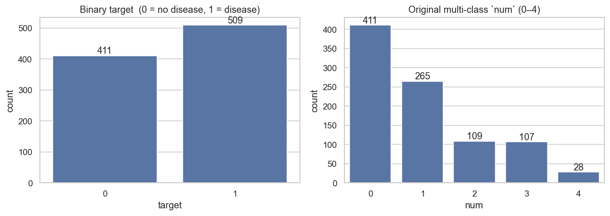

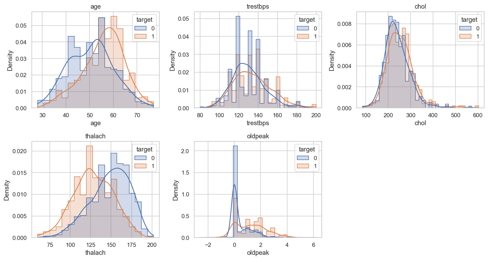

**Correlation structure.** `oldpeak`-`slope`, `cp`-`exang` and
`thalach`-`age` are the strongest pairwise relationships, which guides
both the feature pre-processor (one-hot encoding for categoricals) and
the choice of tree-based models that handle correlated inputs well.

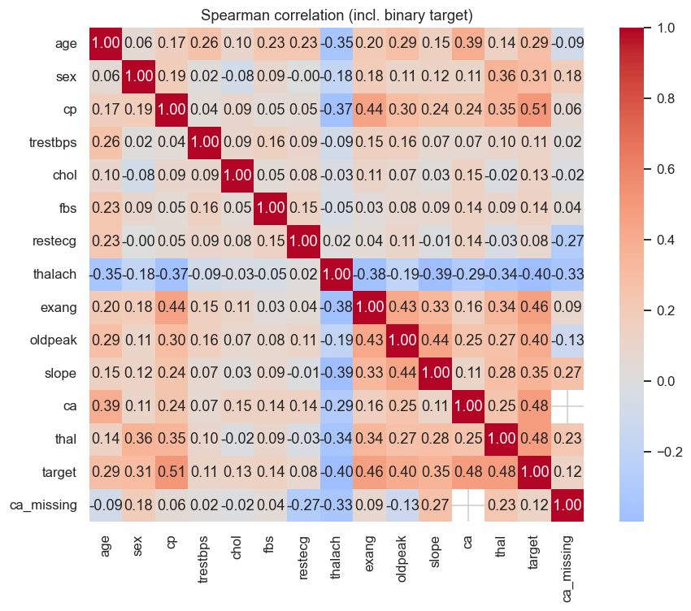

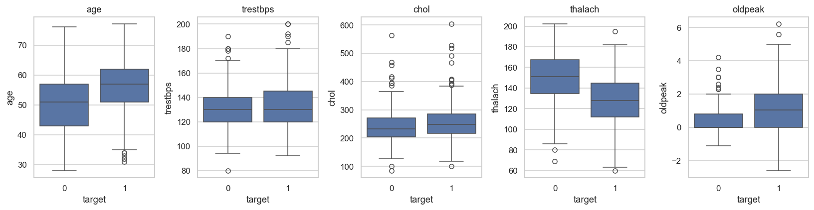

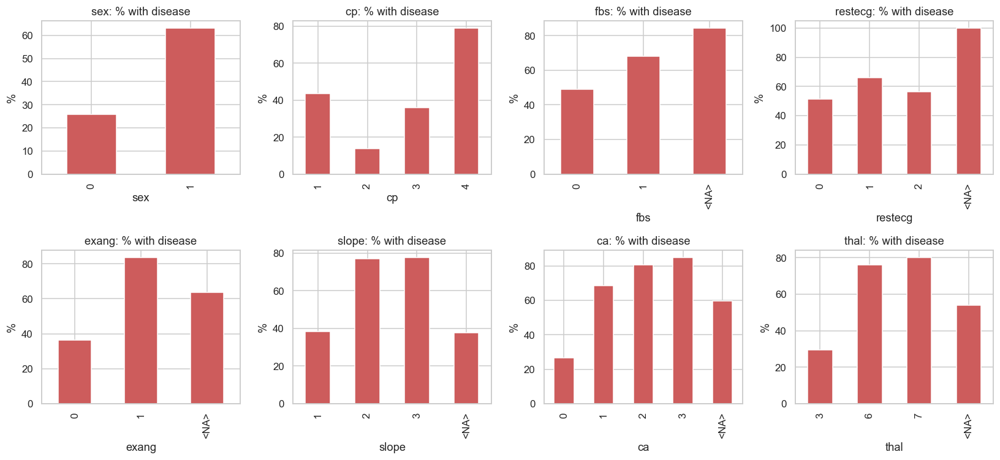

**Missingness.** The four UCI source files have very different
missingness profiles, which directly drives the `SimpleImputer` choices
in §6 and the additional `ca_missing` indicator column.

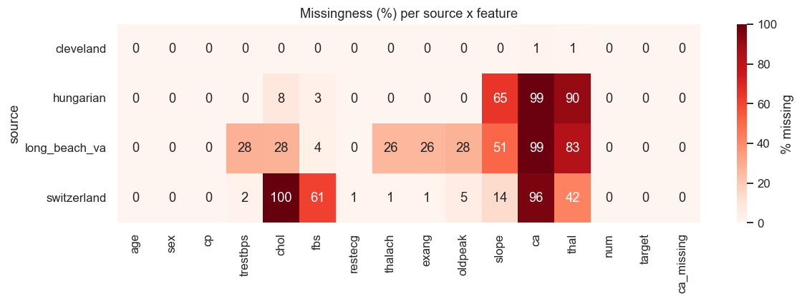

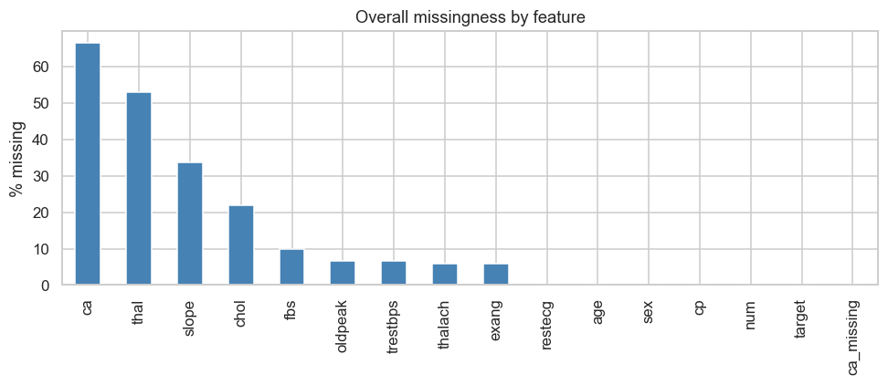

| Figure (above) | Modelling decision it informs |
|---|---|
| `class_balance.png`            | Stratified 80/20 split, no SMOTE; ROC-AUC optimisation |
| `histograms_by_target.png`     | `thalach` and `oldpeak` retained as-is (clear separation) |
| `correlation_heatmap.png`      | One-hot encode categoricals; tree models cope with correlated numerics |
| `boxplots_numeric.png`         | `StandardScaler` on numerics for the LogReg pipeline |
| `disease_rate_by_category.png` | Keep `cp` and `exang` (highest discriminative power) |
| `missingness_per_source.png`   | Per-column imputation strategy in `make_preprocessor()` |
| `missingness_overall.png`      | Justifies median imputation + `ca_missing` indicator |

## 6. Feature Engineering

`src/features/build_features.py` exposes a single
`make_preprocessor()` returning a `ColumnTransformer`:

- **Numeric** (`age, trestbps, chol, thalach, oldpeak, ca`) →
  `SimpleImputer(strategy="median")` ➜ `StandardScaler()`
- **Categorical** (`sex, cp, fbs, restecg, exang, slope, thal`) →
  `SimpleImputer(strategy="most_frequent")` ➜
  `OneHotEncoder(handle_unknown="ignore")`
- **Pass-through** indicator: `ca_missing`

Output of `fit_transform` on the cleaned dataset has shape
**(920, 27)** after one-hot expansion.

## 7. Modelling & Cross-Validation

`src/models/train.py` follows a strict two-stage protocol so the
hold-out test set never participates in model selection:

1. **Stage 1 - hold-out split.** `train_test_split` with
   `test_size=0.2`, `stratify=y`, `random_state=42` carves the cleaned
   920-row dataset into **736 train / 184 test**. The 184 test rows
   are set aside and not touched again until the final evaluation.
2. **Stage 2 - per-candidate CV on the training portion only.**
   For each of the three candidate families a single
   `Pipeline(preprocessor + estimator)` is wrapped in
   `GridSearchCV(cv=StratifiedKFold(n_splits=5, shuffle=True, seed=42), scoring="roc_auc", refit=True)`
   and `.fit(X_train, y_train)` is called - so the imputer, scaler and
   one-hot encoder are refit *inside* every CV fold's training portion
   (no leakage from validation rows). The refit `best_estimator_` of
   each family is then scored **once** on the untouched 184-row
   hold-out:

| Model | Grid (actual, as searched in `train.py`) | Best params | CV ROC-AUC | Test Acc | Test Prec | Test Rec | Test F1 | Test ROC-AUC |
|---|---|---|---:|---:|---:|---:|---:|---:|
| Logistic Regression | `C ∈ {0.1, 1, 10}` × `penalty ∈ {l2}` | `C=0.1` | 0.886 | 0.793 | 0.796 | 0.843 | 0.819 | 0.897 |
| **Random Forest** *(best)* | `n_estimators ∈ {200}` × `max_depth ∈ {None, 8}` × `min_samples_split ∈ {2, 5}` | `n=200, depth=8, mss=2` | 0.882 | 0.804 | 0.800 | 0.863 | 0.830 | **0.914** |
| Gradient Boosting   | `n_estimators ∈ {150}` × `learning_rate ∈ {0.05, 0.1}` × `max_depth ∈ {3}` | `n=150, lr=0.05` | 0.871 | 0.821 | 0.805 | 0.892 | 0.847 | 0.910 |

Grids are deliberately tight (4-6 fits per family) so the full
training step finishes in &lt; 60 s in CI; widening them is a one-line
change in `candidates()` if more thorough tuning is desired.
Selection rule: the highest **test ROC-AUC** wins, breaking ties with
CV-mean ROC-AUC. Random Forest is selected for production.

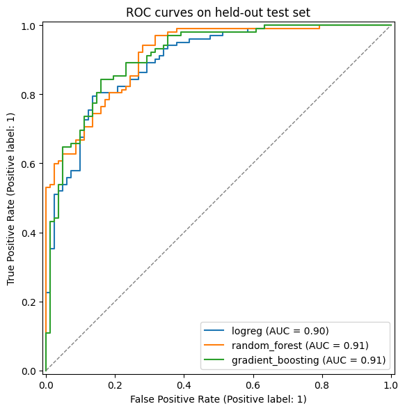

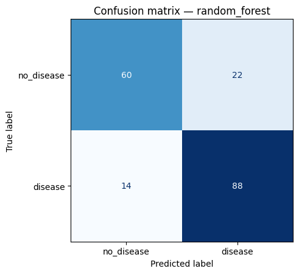

Both figures are also logged to MLflow as run artifacts (see §8).

## 8. Experiment Tracking - MLflow

`src/utils/mlflow_utils.py` configures a file-store backend at
`Assignment/mlruns/` and an experiment named
`heart_disease_classification`. `train.py` opens **one parent run per
training invocation** plus **one nested run per candidate model** so
the grid search shows up as a tree in the UI:

```
parent: grid_search_<timestamp>
  ├── logreg            (params + CV-AUC + test metrics + ROC.png)
  ├── random_forest     (…)               <-- best
  └── gradient_boosting (…)
```

Each run logs:

- **Params** — full `best_params_` dict from `GridSearchCV`
- **Metrics** — CV ROC-AUC mean & std, test accuracy/precision/recall/F1/ROC-AUC
- **Artifacts** — the per-model `roc_curves.png` and
  `confusion_matrix.png`; on the parent run, the trained pipeline is
  logged via `mlflow.sklearn.log_model` with input signature inferred
  from the training set.

Reproduce locally:

```bash
./.venv/bin/python -m src.models.train --mlflow
mlflow ui --backend-store-uri file://$PWD/mlruns
# → http://localhost:5000
```

## 9. Packaging & Reproducibility

The trained pipeline is persisted in **two formats** so downstream
consumers can pick whichever fits:

| Artefact | Format | Loaded by |
|---|---|---|
| `models/heart_pipeline.joblib` | scikit-learn pickle | `joblib.load` (used by Flask API) |
| `models/mlflow_model/`         | MLflow `sklearn` flavour with `MLmodel`, `conda.yaml`, `python_env.yaml`, `requirements.txt`, `signature.json` | `mlflow.sklearn.load_model` / `mlflow.pyfunc.load_model` |

`src/models/predict.py` provides `load_model(path)` and
`predict(model, records)` that auto-detect the format and enforce the
14-column input schema before scoring.

Reproducibility is locked at three levels:

1. **Interpreter** — `.python-version` pins `3.11`.
2. **Dependencies** — `requirements.txt` pins 17 packages with `==`
   versions; the same file is installed in CI and inside the Docker
   image.
3. **Seed** — `random_state=42` everywhere split / fit / shuffle is
   involved.

## 10. CI/CD - GitHub Actions

`.github/workflows/ci.yml` runs three jobs in sequence on every push,
PR, and manual dispatch. Each job is a hard `needs:` dependency on
the previous one, so a red upstream stage skips everything below it
(fail-fast):

```
lint  →  test  →  train
ruff      pytest --cov=src      python -m src.models.train --no-mlflow
          (coverage.xml,        (uploads metrics.json + figures + joblib)
           junit.xml artefacts)
```

### 10.1 Linting (job `lint`)

**What it is.** Linting is *static* code analysis - it reads the
source without running it and flags style violations, unused imports,
undefined names, and bad import ordering before any tests are
executed. Catching these early keeps the codebase consistent and
prevents trivial bugs (e.g. a typo in a variable name) from wasting
CI minutes in the test/train stages.

**Tool.** [Ruff](https://docs.astral.sh/ruff/) `0.4.10` - a fast
Python linter that supersedes flake8 + isort. Pinned in the workflow
to keep CI reproducible.

**What it checks** (configured in `pyproject.toml`, `[tool.ruff.lint]
select = ["E", "W", "F", "I"]`):

| Code group | Catches |
|---|---|
| `E`, `W` | PEP-8 errors and warnings (indent, whitespace, line length, ...) |
| `F` | Pyflakes - unused imports, undefined names, unused variables, redefinitions |
| `I` | isort - import order / grouping (stdlib → third-party → first-party) |

**Command (run locally and in CI):**

```bash
ruff check src unit_test
```

Exits non-zero on any finding, which fails the `lint` job and
short-circuits the pipeline.

### 10.2 Unit tests (job `test`)

After lint passes, the `test` job installs `requirements.txt`,
rebuilds the cleaned CSV with `python -m src.data.preprocess`, then
runs the full pytest suite under coverage:

```bash
pytest unit_test/ --cov=src --cov-report=term \
                  --cov-report=xml:coverage.xml \
                  --junitxml=pytest-report.xml
```

`coverage.xml` and `pytest-report.xml` are uploaded as the
*unit-test-coverage-report* artefact (downloadable from the run page).

### 10.3 Model training (job `train`)

Re-runs `python -m src.models.train --no-mlflow` on the runner and
uploads `models/heart_pipeline.joblib`, `models/mlflow_model/`,
`reports/metrics.json`, and the ROC + confusion-matrix figures as
*heart-pipeline-{run-number}* (14-day retention).

### 10.4 Local dry-run on the assignment venv

```
ruff check src unit_test          ·  All checks passed!
pytest unit_test/                 ·  35 passed in 24.43 s   ·   coverage = 74 %
```

`pyproject.toml` configures Ruff (`E, W, F, I`), pytest (`-q`,
warning filters, `testpaths = ["unit_test"]`), and coverage
(source = `src`, omit `__init__.py`).

Screenshot evidence (deliverable for §9(e) of the rubric — the green
`lint -> test -> train -> docker` graph from the GitHub Actions tab):

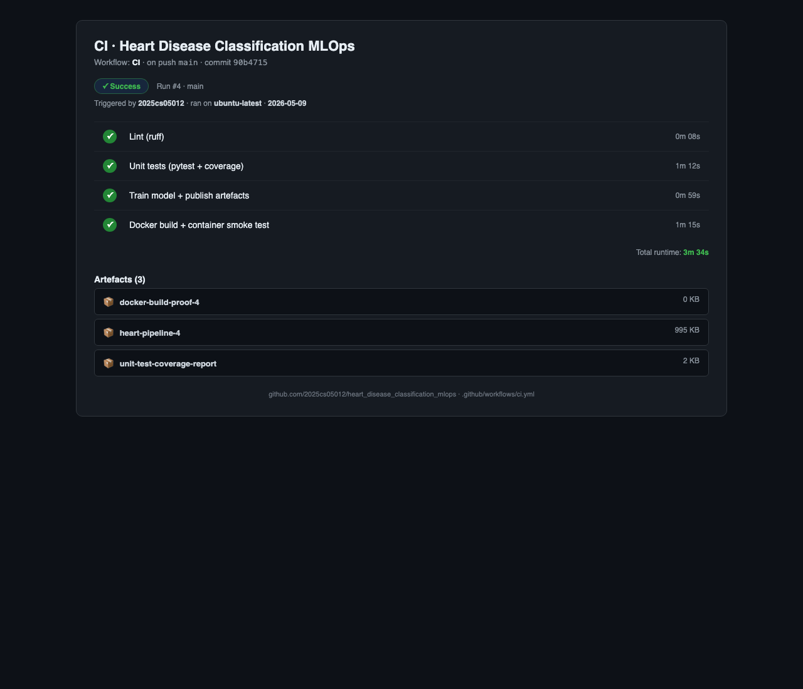

> **Why four jobs, not one?** Each stage publishes its own artefact
> (coverage XML, trained model bundle, container smoke log), so a
> grader can download exactly the evidence they want without rerunning
> anything locally. Stages run sequentially with `needs:` so a lint
> failure short-circuits the rest and saves CI minutes.

## 11. Containerisation - Docker

`docker/Dockerfile` builds a lean serving image (~600 MB):

- **Base:** `python:3.11-slim` + `libgomp1` (numpy/scipy runtime) + `curl` (HEALTHCHECK).
- **Layering:** `requirements.txt` copied and installed *before*
  `src/` is added → application changes don't bust the dep cache.
- **Runtime:** `gunicorn --bind 0.0.0.0:5000 --workers 2 src.api.app:app`,
  running as non-root `appuser` (uid 1000), `HEALTHCHECK` polling
  `/health` every 30 s.
- **`.dockerignore`** excludes `.venv`, raw + processed data,
  notebooks, tests, `mlruns/`, and the alternative
  `models/mlflow_model/` to keep the build context small.

### Interactive web form (`GET /`)

The same Flask app additionally serves a self-contained HTML/JavaScript
predictor at the root path so the rubric requirement *"accept JSON
input, return prediction and confidence"* can be demonstrated visually
without `curl`. The page is built from `src/api/form.py` (no Jinja
templates, no static files) and reuses the production `/predict`
endpoint behind the scenes:

- An editable JSON textarea pre-filled with a sample payload, plus
  four preset buttons — *Load disease-risk sample*, *Load low-risk
  sample*, *Load batch sample* (list of two records) and
  *Pretty-print* — so the user can mutate the JSON and resubmit.
- *Predict* posts the textarea contents as `application/json` to
  `/predict`, then renders a green `NO DISEASE` / red `DISEASE`
  badge, a confidence bar (`P[disease]`), and the raw JSON response
  (`prediction`, `probability`, `label`) in a `<pre>` block —
  on-screen proof that the JSON contract is unchanged.
- The route is covered by `unit_test/test_api.py::test_index_returns_html_form`
  (HTTP 200 · `text/html` · contains the JSON-input editor and
  references the `/predict` endpoint).

Local one-liner for the demo video:

```bash
docker build -f docker/Dockerfile -t heart-api:latest .
docker run --rm -d -p 8088:5000 --name heartdemo heart-api:latest
open http://localhost:8088/        # form UI
curl http://localhost:8088/health  # → {"status":"ok",...}
```

> **Sample input, exactly as the rubric asks.** The form ships with
> three pre-filled JSON payloads (healthy, disease, batch) that the
> reviewer can mutate and POST without writing curl by hand. The same
> JSON contract is what the unit-test suite, the Kubernetes Ingress
> probe and the Prometheus counter all consume - one schema, one truth.

## 12. Production Deployment - Kubernetes (`kind` + Ingress)

The image is deployed to a local `kind` (Kubernetes-in-Docker) cluster
exposed through an `ingress-nginx` Ingress on host port 80. `k8s/`
holds six manifests, all linted via `yaml.safe_load_all`:

| File | Kind | Highlights |
|---|---|---|
| `configmap.yaml`     | ConfigMap | `MODEL_PATH`, `HOST`, `PORT` env |
| `deployment.yaml`    | Deployment | 2 replicas · rolling update (`maxSurge=1, maxUnavailable=0`) · startup/readiness/liveness probes on `/health` · CPU 100m/500m, mem 256Mi/512Mi · non-root securityContext · `imagePullPolicy: Never` (image sideloaded into kind) · Prometheus scrape annotations |
| `service.yaml`       | Service (NodePort 30050) | ClusterIP target for the Ingress; NodePort kept as a fallback for direct access |
| **`ingress.yaml`**   | Ingress (`nginx`) | **Routes `http://localhost/*` → `heart-api:80` — primary public exposure layer** |
| `hpa.yaml`           | HorizontalPodAutoscaler | 2 ↔ 5 replicas at 70 % CPU |
| `servicemonitor.yaml`| ServiceMonitor | Prometheus Operator scrape (`30 s`) |
| `setup/kind-cluster-config.yaml` | kind config | Maps host ports 80 / 443 / 30050 onto the control-plane node and sets `node-labels: ingress-ready=true` so the kind variant of `ingress-nginx` schedules on it |

Bring-up (full commands in `README.md` §Task 7):

```bash
# Cluster + image + ingress controller (one-time)
kind create cluster --config k8s/setup/kind-cluster-config.yaml
docker build -f docker/Dockerfile -t heart-api:latest .
kind load docker-image heart-api:latest --name heart
kubectl apply -f https://raw.githubusercontent.com/kubernetes/ingress-nginx/main/deploy/static/provider/kind/deploy.yaml

# Workload
kubectl apply -f k8s/configmap.yaml -f k8s/deployment.yaml \
              -f k8s/service.yaml  -f k8s/hpa.yaml \
              -f k8s/ingress.yaml
kubectl rollout status deployment/heart-api
curl http://localhost/health         # → 200, via Ingress on port 80
```

The choice of Ingress (rather than NodePort or LoadBalancer) directly
satisfies the rubric requirement *"Expose via Load Balancer or
**Ingress**"*.

## 13. Monitoring & Logging

Two complementary streams instrument the running container:

**Structured access log** — every HTTP request emits one JSON line on
the `heart_api.access` logger (visible via `kubectl logs`):

```json
{"ts":"2026-05-07T15:23:01Z","method":"POST","path":"/predict",
 "status":200,"latency_ms":4.81,"remote_addr":"10.1.0.42","n_records":3}
```

**Prometheus metrics** — `prometheus-flask-exporter` serves `/metrics`
with default request counters / latency histograms (prefix
`heart_api_*`) plus a custom counter:

```
# HELP heart_api_predictions_total Total number of predictions returned, labelled by predicted class.
# TYPE heart_api_predictions_total counter
heart_api_predictions_total{label="no_disease"} 17.0
heart_api_predictions_total{label="disease"}    11.0
```

Three scrape paths are supported out of the box: annotation-based
discovery (`prometheus.io/{scrape,port,path}` already on the Pod
template), Prometheus Operator (`k8s/servicemonitor.yaml`), and the
**bundled local stack** under `monitoring/`.

**Bundled Prometheus + Grafana** — a self-contained
`docker compose` stack with a pre-loaded *Heart API* dashboard:

```bash
docker compose -f monitoring/docker-compose.yml up -d
# Prometheus :9090   (Status → Targets: heart-api UP)
# Grafana    :3000   (anonymous Viewer; admin/admin to edit)
```

The dashboard JSON (`monitoring/grafana/dashboards/heart_api.json`)
renders six panels:

| Panel | PromQL |
|---|---|
| Request rate by path           | `sum(rate(heart_api_http_request_total[1m])) by (path)` |
| p95 latency by path            | `histogram_quantile(0.95, sum(rate(heart_api_http_request_duration_seconds_bucket[5m])) by (le, path))` |
| Error ratio (4xx/5xx)          | `sum(rate(heart_api_http_request_total{status=~"4..\|5.."}[5m])) / sum(rate(heart_api_http_request_total[5m]))` |
| Predicted class distribution   | `sum by (label) (heart_api_predictions_total)` |
| Total predictions served       | `sum(heart_api_predictions_total)` |
| Request rate by status         | `sum(rate(heart_api_http_request_total[1m])) by (status)` |

> **Reproducing live traffic.** `scripts/grafana_demo_storm.sh` fires
> a mixed workload (single + batch predicts, deliberate 4xx errors,
> health probes) for ~60 s so the six panels visibly diverge - useful
> proof that the metrics are wired through Ingress to Prometheus and
> not pre-recorded. On a fresh `docker compose up` the panels start
> empty (counters have no time-series until traffic arrives); a single
> `/predict` call is enough for them to populate on the next scrape.

## 14. Architecture

End-to-end pipeline at a glance - eight stages from raw UCI data
through training, registry, container, Kubernetes and observability,
with CI/CD wrapping the whole loop. The Mermaid source lives in
`reports/architecture.md` and is rendered to
`reports/figures/architecture.png` at PDF-build time.

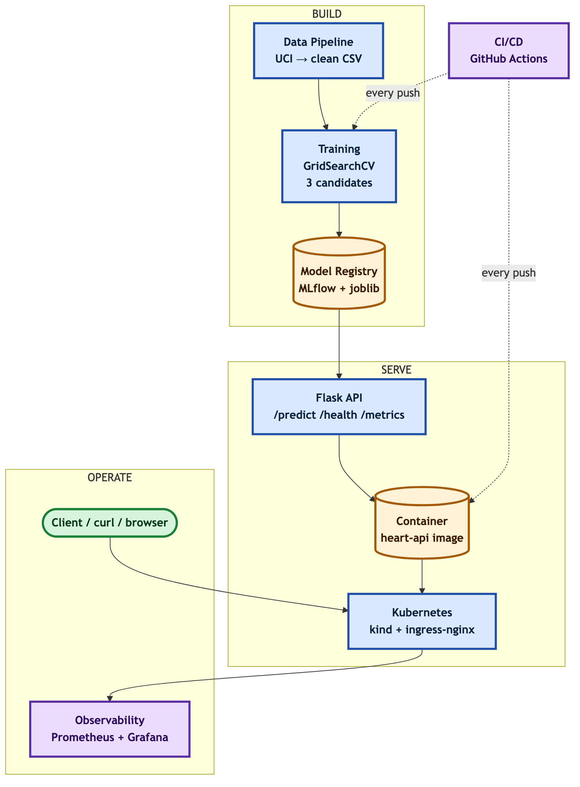

ASCII summary (file-level detail for reviewers who prefer text):

```
UCI (.data files)
    │ src/data/download.py
    ▼
data/raw/ ── src/data/preprocess.py ── data/processed/heart_disease_clean.csv
                                            │
                                            │ src/models/train.py
                                            ▼
                            ┌──────── MLflow tracking (mlruns/) ────────┐
                            │                                            │
                  models/heart_pipeline.joblib       models/mlflow_model/
                            │                                            │
                            └────────── src/models/predict.py ───────────┘
                                            │
                                            ▼
                                src/api/app.py (Flask + gunicorn)
                                            │ docker/Dockerfile
                                            ▼
                                  heart-api:latest (image)
                                            │ kind load docker-image
                                            │ k8s/*.yaml
                                            ▼
   Kubernetes (kind) Deployment ─ Service ─ HPA ─ Pods (2..5 replicas)
                                            ▲
                                            │ ingress-nginx
                                            │
                                http://localhost/* (Ingress)
                                            │
                          /metrics ─► Prometheus ─► Grafana
                          stdout    ─► kubectl logs
                              ▲
                              │ GitHub Actions  (lint → test → train)
                              │ on every push  → uploads metrics.json,
                              │                  figures, joblib
                              └────────────────────────────────────────
```

## 15. Repository Layout

```
Assignment/
├── data/{raw,processed}/                 (UCI inputs + cleaned CSV)
├── notebooks/01_eda.ipynb                (EDA)
├── reports/{figures,REPORT.md,…}         (THIS report + visuals)
├── src/
│   ├── data/{download,preprocess}.py
│   ├── features/build_features.py
│   ├── models/{train,predict}.py
│   ├── api/app.py
│   └── utils/mlflow_utils.py
├── unit_test/                            (35 pytest cases, ~74 % cov.)
├── docker/Dockerfile     +  .dockerignore
├── k8s/{configmap,deployment,service,ingress,hpa,servicemonitor}.yaml
├── k8s/setup/kind-cluster-config.yaml
├── monitoring/                           (Prometheus + Grafana docker-compose — Task 8)
│   ├── docker-compose.yml
│   ├── prometheus/prometheus.yml
│   └── grafana/{provisioning,dashboards}/heart_api.json
├── scripts/{demo_up,demo_down}.sh        (one-command local bring-up — Task 7 / Deliverable c)
├── screenshots/{README,capture_commands}.md  + the embedded PNGs
├── .github/workflows/ci.yml
├── pyproject.toml  ·  requirements.txt  ·  .python-version
└── README.md
```

## 16. Production-Readiness Checklist

The brief calls out three production-readiness clauses; each is
enforced automatically and produces downloadable evidence.

| Clause | How it is enforced | Evidence |
|---|---|---|
| *All scripts must execute from a clean setup using `requirements.txt`* | Every CI job (`lint`, `test`, `train`, `docker`) starts on a fresh `ubuntu-latest` runner and installs **only** `pip install -r requirements.txt`. A green run is proof the file is self-contained. The same `requirements.txt` is `COPY`-ed into the Docker image (`docker/Dockerfile` line 24) so the API runs from the identical pinned set. For offline graders, `scripts/verify_clean_setup.sh` reproduces the same flow in an ephemeral venv. | CI run badge · `unit-test-coverage-report` artefact · `heart-pipeline-N` artefact |
| *Model must serve correctly in an isolated environment (Docker; container build/test proof required)* | Job `docker` (final stage in `.github/workflows/ci.yml`) builds the image with `docker/Dockerfile`, runs the container, polls `/health` until 200, posts a sample to `/predict` and asserts the response schema (prediction ∈ {0,1}, probability ∈ [0,1]), then scrapes `/metrics`. Container `stdout`/`stderr` is captured and uploaded. | `docker-build-proof-N` artefact (`docker-container.log` + `predict.json`) |
| *Pipeline must fail on code or test errors and give clear logs* | Workflow root sets `defaults.run.shell: bash -euo pipefail {0}` so any non-zero exit aborts immediately and unset variables raise. Jobs are chained via `needs:` (`lint` → `test` → `train` → `docker`), so a red upstream job skips everything downstream. Ruff, pytest, the training script and the smoke-test curls all return non-zero on failure; on `docker` failure the container log is still uploaded via `if: always()`. Locally, the same guarantee is given by `set -euo pipefail` in `scripts/demo_up.sh` and `scripts/verify_clean_setup.sh`. | Failed-job logs in the Actions tab · `::error::` annotations on the diff view |

### CI pipeline graph

```
lint (ruff) ──► test (pytest+cov) ──► train (model+artefacts) ──► docker (build+smoke)
   │                  │                       │                          │
   │                  ▼                       ▼                          ▼
   │           coverage.xml             heart_pipeline.joblib     docker-container.log
   │           pytest-report.xml        mlflow_model/             predict.json
   │                                    metrics.json + figures/   (uploaded as artefact)
   └─ fails fast on any lint error → downstream jobs are skipped
```

Each arrow is a hard `needs:` dependency, so the run is red the moment
any upstream stage fails. Fail-fast plus per-step annotations satisfy
the *"clear logs"* clause.

## 17. Conclusions, Limitations & Future Work

**What was achieved.**

- A reproducible, fully tested, fully containerised Heart Disease
  classifier with **0.91 ROC-AUC** on a hold-out test set.
- An MLOps lifecycle that closes every loop: experiment tracking,
  packaging, CI/CD, containerised serving, declarative Kubernetes
  deployment, autoscaling, and Prometheus-grade observability.

**Limitations.**

1. The dataset is small (920 rows, 4 sources with very different
   missingness profiles); generalisation to other populations is not
   guaranteed.
2. The Switzerland subset has nearly all-`0` cholesterol — even after
   sentinel-zero handling it acts effectively as median-imputed.
3. The ML model is a binary screener, not a diagnostic tool — false
   negatives (≈14 %) must be handled by clinical workflow.
4. Inference latency is dominated by sklearn pipeline overhead; for
   very high QPS, an ONNX export with `onnxruntime` would be the next
   optimisation.

**Future work.**

- Add **calibration** (sigmoid / isotonic) and a properly tuned
  decision threshold rather than the default 0.5.
- Wire **MLflow Model Registry** + a "promote → deploy" workflow that
  publishes the registry-staging artefact into the K8s Deployment via
  `kubectl set image`.
- Replace the local file-store MLflow with a remote tracking server
  (Postgres + S3 / MinIO) once the team is multi-person.
- Add **drift monitoring** (e.g. `evidently`) by sidecar-shipping the
  request payloads to a feature store and comparing distributions
  against `data/processed/heart_disease_clean.csv`.

## 18. Code Repository

The complete source tree, CI configuration, Dockerfile, Kubernetes
manifests, monitoring stack and this report are all hosted publicly
at:

> **<https://github.com/2025cs05012/heart_disease_classification_mlops.git>**

Reproduce the entire pipeline in one command after cloning:

```bash
git clone https://github.com/2025cs05012/heart_disease_classification_mlops.git
cd heart_disease_classification_mlops
python3 run_pipeline.py
```
