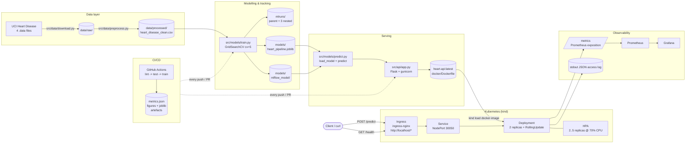
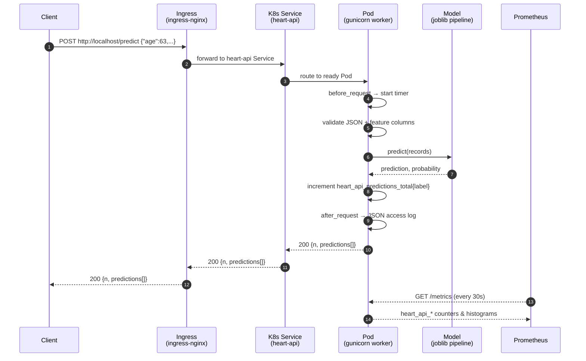

# Architecture — Heart Disease MLOps Pipeline

GitHub renders Mermaid blocks natively. Export to PNG/SVG with the
[Mermaid CLI](https://github.com/mermaid-js/mermaid-cli):

```bash
mmdc -i reports/architecture.md -o reports/figures/architecture.png \
     -t neutral -b transparent
```

## End-to-end flow



## Request lifecycle


